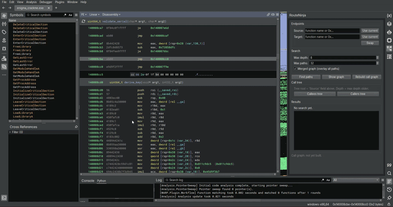

# RouteNinja

Author: **0Dr3f**

_Identify paths from function **A** to function **B**._


<p align="center">
  
</p>

Binary Ninja plugin for figuring out *how* one function ends up calling
another. You pick two functions, it runs a bidirectional BFS over the call
graph, and shows you the paths between them as a flow graph you can click
through.

Also does call trees from a single function, forward (callees) or backward
(callers), if you just want to see "what does this reach?" or "what reaches
this?".

<p align="center">
  
</p>


## Features

- Pick source and target from the sidebar, a right-click menu, or the
  scripting console.
- Bidirectional BFS so it scales to real binaries.
- Configurable max depth and max paths.
- Merged graph: all paths in one view, shared functions collapse into a
  single node so you can see where branches fork and rejoin. Or double-click
  a single path in the results list to see that one on its own.
- Each edge remembers the call-instruction addresses inside the caller,
  so you can tell *which* call on a given line triggered the transition.
- Call-tree view: hand it one function, get a BFS expansion of callees or
  callers up to a depth you choose. Cycles and shared helpers don't blow
  it up because every function gets one node.
- Import thunks count as endpoints. Set the target to `RegCreateKeyExW` or
  `malloc` or whatever and you'll see every path that ends up calling it.
- The call graph is built once per BinaryView and cached. If you add a
  function or change something, hit "Rebuild call graph".

## Install

Either install it from Binary Ninja's Plugin Manager once it's
listed, or clone this repo into your plugins directory yourself:

| OS      | Path                                                                   |
| ------- | ---------------------------------------------------------------------- |
| Windows | `%APPDATA%\Binary Ninja\plugins\RouteNinja\`                           |
| Linux   | `~/.binaryninja/plugins/RouteNinja/`                                   |
| macOS   | `~/Library/Application Support/Binary Ninja/plugins/RouteNinja/`       |

```bash
git clone https://github.com/0Dr3f/RouteNinja.git
```

Restart Binary Ninja. RouteNinja shows up in the right-hand sidebar.

## Using it

### Sidebar

1. Open a binary.
2. Click inside the function you want as the source, hit **Use current**
   next to *Source*.
3. Click inside the function you want as the target, hit **Use current**
   next to *Target*.
4. **Find paths**.

If *Merged graph* is checked the graph opens automatically. Otherwise the
results populate the list and you double-click the one you want, or hit
*Show graph* for the merged view.

For a call tree, put the function you care about in the **Source** field
and hit **Callees tree** or **Callers tree**. Depth comes from the same
max-depth spinbox the path search uses.

### Right-click menu

Under `Plugins → RouteNinja`:

- `Set as Source`
- `Set as Target`
- `Find Paths To This Function`
- `Find Paths From This Function`
- `Find Paths (configured endpoints)`
- `Show Last Paths Graph`
- `Call Tree (callees) From This Function`
- `Call Tree (callers) Of This Function`

### Scripting console

```python
route_ninja.set_source(bv.get_functions_by_name("main")[0])
route_ninja.set_target(bv.get_functions_by_name("report_error")[0])
paths = route_ninja.find_paths(max_depth=10, max_paths=20)
for p in paths:
    print(route_ninja.format_path(p))

# Everything main reaches within 4 hops, as a tree.
tree = route_ninja.build_call_tree(
    root=bv.get_functions_by_name("main")[0].start,
    direction="callees",
    max_depth=4,
)
```

`route_ninja` is injected into `builtins` at plugin load, so you don't
need to import it.

## How it works, roughly

The call graph gets projected once per BinaryView using each function's
`callees` list and `bv.get_callees(site)` on each call site. Indirect
calls show up too, but only the ones Binary Ninja's own dataflow managed
to resolve.

Search is bidirectional BFS. Each side walks `max_depth / 2` hops, then
paths are stitched through the nodes where the two frontiers meet. Only
shortest paths through each meeting node come out, i.e. if there's a 4-hop
route it won't also show you the 6-hop scenic one. Feature, not bug.

Cycle handling is the boring kind: the predecessor walk refuses to revisit
a node already on the current path, so recursive call graphs don't explode.


## Layout

```
.
├── __init__.py            Plugin entry point
├── route_ninja.py         Call graph + BFS + call tree
├── graph_view.py          FlowGraph rendering
├── gui_wrapper.py         PluginCommands + sidebar widget
├── logo.png               Sidebar icon
├── plugin.json            Plugin metadata
├── requirements.txt       (no external deps, just here by convention)
├── LICENSE                GPL-3.0
├── README.md              You are here
└── tests/
    └── smoke_test.py      End-to-end tests via the binja-headless RPyC server
```

## License

[GPL-3.0](LICENSE).
